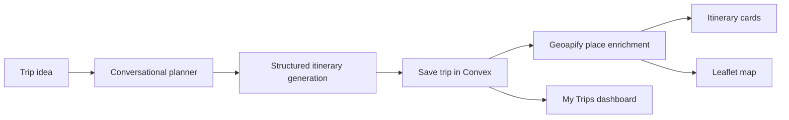
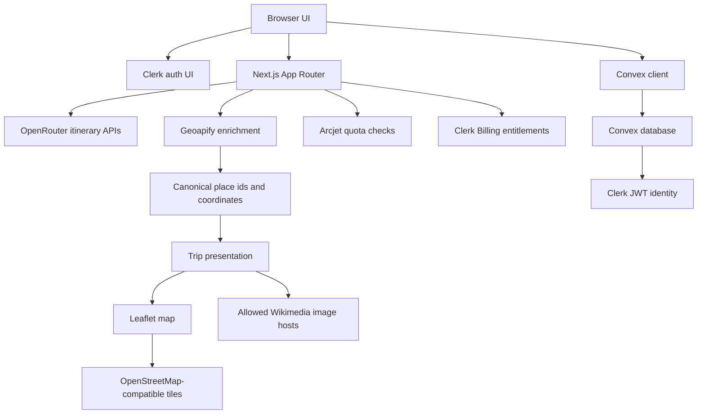

# AI Trip Planner

AI Trip Planner is a production-oriented trip planning app built with the
Next.js App Router. It turns a conversational travel brief into a structured
day-by-day itinerary, enriches real places with provider-backed location data,
and lets authenticated users save and revisit trips.

Built with Next.js 16.3.2, React 19, TypeScript, Tailwind CSS 4, Clerk,
Convex, OpenRouter, Geoapify, Leaflet, OpenStreetMap tiles, Arcjet, Vitest, and
ESLint.

## What It Does

- Guides users through a conversational trip planning flow for origin,
  destination, duration, budget, group size, and travel style.
- Generates structured itineraries with hotels, daily sections, activities,
  practical notes, and provider-safe place metadata.
- Saves generated trips to Convex under the authenticated user's identity.
- Enriches hotels and attractions through a server-only Geoapify route before
  showing map markers or canonical place details.
- Renders an interactive Leaflet map with OpenStreetMap-compatible tiles.
- Displays destination and accepted place imagery through a constrained
  external-image boundary.
- Separates free quota handling from paid unlimited generation through Arcjet
  and Clerk Billing.

## Product Workflow



## Architecture

The app keeps provider credentials and enrichment logic on the server while the
client renders the interactive planning, itinerary, and map experience.



Key architecture notes are documented in
[docs/ARCHITECTURE.md](docs/ARCHITECTURE.md) and provider decisions are
captured in [docs/DECISIONS.md](docs/DECISIONS.md).

## Main Routes

| Route | Purpose |
| --- | --- |
| `/` | Landing page with the trip composer and product preview. |
| `/create-trip` | Authenticated conversational trip builder and generation workspace. |
| `/my-trips` | Authenticated saved-trip dashboard. |
| `/view-trip/[tripId]` | Authenticated saved itinerary view with itinerary and map. |
| `/pricing` | Clerk Billing-powered pricing surface. |
| `/sign-in` and `/sign-up` | Clerk authentication pages. |

## Tech Stack

| Area | Implementation |
| --- | --- |
| Framework | Next.js 16 App Router, React 19, TypeScript 5 |
| Styling | Tailwind CSS 4, shadcn-style UI primitives, lucide-react icons |
| Authentication | Clerk middleware, protected routes, custom sign-in and sign-up pages |
| Billing | Clerk Billing entitlement checks for unlimited trip generation |
| Database | Convex queries and mutations with owner-scoped trip access |
| AI | OpenRouter through the OpenAI SDK with strict itinerary contracts |
| Quota | Arcjet rate and quota protection for free generation |
| Place data | Server-only Geoapify geocoding and place details |
| Maps | Leaflet with OpenStreetMap-compatible tiles |
| Images | Project-controlled landing assets plus allowlisted Wikimedia hosts |
| Quality | Vitest, ESLint, TypeScript strict mode |

## Project Structure

```text
app/
  (app)/create-trip/        Authenticated trip creation page
  (app)/my-trips/           Saved-trip dashboard
  (app)/view-trip/[tripId]/ Saved itinerary page
  api/ai-itinerary/         Final itinerary generation route
  api/ai-model/             Conversational planner route
  api/place-enrichment/     Server-only place enrichment route
components/
  create-trip/              Trip builder workspace and controls
  landing/                  Landing page sections
  navigation/               Header and app navigation
  trips/                    Saved-trip and itinerary presentation
  ui/                       Shared UI primitives
convex/
  schema.ts                 Convex schema
  trips.ts                  Owner-scoped trip operations
lib/
  ai/                       AI contracts, prompts, and parsing
  billing/                  Billing feature constants
  images/                   External image validation helpers
  places/                   Geoapify and place enrichment logic
  quota/                    Arcjet quota logic
tests/                      Vitest tests for contracts and core behavior
docs/                       Project, architecture, environment, and production notes
```

## Getting Started

### Prerequisites

- Node.js 24.x
- npm 11.x
- Clerk application credentials
- Convex project
- OpenRouter API key and model
- Geoapify API key
- Arcjet key

### Installation

```bash
git clone https://github.com/mohammad30395/AI-Trip-Planner.git
cd AI-Trip-Planner
npm ci
```

Create a local environment file manually:

```bash
touch .env.local
```

This repository does not currently include an `.env.example` file. Use the
variables below and the details in [docs/ENVIRONMENT.md](docs/ENVIRONMENT.md).

Start the development server:

```bash
npm run dev
```

Open `http://localhost:3000` in a browser.

## Environment Variables

Environment setup details live in
[docs/ENVIRONMENT.md](docs/ENVIRONMENT.md). Do not expose server-only values to
the browser, and do not create client-side provider keys for Geoapify, OpenRouter,
Arcjet, Clerk secrets, or Convex deploy keys.

| Variable | Scope | Purpose |
| --- | --- | --- |
| `NEXT_PUBLIC_CLERK_PUBLISHABLE_KEY` | Client-safe | Clerk browser authentication. |
| `NEXT_PUBLIC_CLERK_SIGN_IN_URL` | Client-safe | Custom sign-in route. |
| `NEXT_PUBLIC_CLERK_SIGN_UP_URL` | Client-safe | Custom sign-up route. |
| `NEXT_PUBLIC_CLERK_SIGN_IN_FALLBACK_REDIRECT_URL` | Client-safe | Post-sign-in fallback redirect. |
| `NEXT_PUBLIC_CLERK_SIGN_UP_FALLBACK_REDIRECT_URL` | Client-safe | Post-sign-up fallback redirect. |
| `NEXT_PUBLIC_CONVEX_URL` | Client-safe | Convex client endpoint. |
| `NEXT_PUBLIC_CONVEX_SITE_URL` | Client-safe | Convex site URL when generated by deployment tooling. |
| `CLERK_SECRET_KEY` | Server-only | Clerk server authentication and billing calls. |
| `CLERK_JWT_ISSUER_DOMAIN` | Server/build | Convex Clerk JWT issuer configuration. |
| `CONVEX_DEPLOYMENT` | Server/build | Convex deployment identifier. |
| `CONVEX_DEPLOY_KEY` | Build-only | Enables Convex deploy during the Vercel build command. |
| `OPEN_ROUTER_API_KEY` | Server-only | OpenRouter API access. |
| `OPEN_ROUTER_MODEL` | Server-only | Model used for itinerary generation. |
| `GEOAPIFY_API_KEY` | Server-only | Geoapify geocoding and place details. |
| `ARCJET_KEY` | Server-only | Free-tier quota and abuse protection. |

`.env.local` is ignored by git. Never commit real provider credentials.

## Development Commands

| Command | Description |
| --- | --- |
| `npm run dev` | Start the local Next.js development server. |
| `npm run build` | Build the production Next.js app. |
| `npm run build:vercel` | Run the Vercel build wrapper with optional Convex deploy behavior. |
| `npm run start` | Start a built Next.js app. |
| `npm run lint` | Run ESLint. |
| `npm test` | Run the Vitest suite once. |
| `npm run test:watch` | Run Vitest in watch mode. |
| `npx tsc --noEmit` | Run a strict TypeScript type check. |

## Security and Data Boundaries

- AI, Geoapify, Arcjet, Clerk secret, and Convex deploy credentials stay on
  server routes or build tooling.
- `proxy.ts` applies Clerk middleware for the current Next.js App Router setup.
- Convex trip reads and writes are scoped to the authenticated user's Clerk
  identity.
- Place coordinates used by maps come from accepted Geoapify matches, not from
  model-generated coordinates.
- External images are constrained by validation logic and `next.config.ts`
  remote host allowlists.
- The map and provider boundaries are documented in
  [docs/DECISIONS.md](docs/DECISIONS.md) and enforced through server routes and
  allowlisted client assets.

## Testing and Quality

The test suite covers AI response contracts, billing and map behavior, trip
creation flow, external image validation, Geoapify normalization, place
enrichment, Wikimedia image handling, and saved-trip dashboard behavior.

Recommended checks before a pull request or deployment:

```bash
npm test
npm run lint
npx tsc --noEmit
npm run build
```

## Deployment

Deployment is prepared for Vercel but this repository does not publish a live
production URL in the README.

`vercel.json` configures:

- Install command: `npm ci`
- Build command: `npm run build:vercel`

The Vercel build wrapper in `scripts/vercel-build.mjs` deploys Convex when
`CONVEX_DEPLOY_KEY` is configured, otherwise it requires an existing
`NEXT_PUBLIC_CONVEX_URL` for the application build.

Use [docs/PRODUCTION.md](docs/PRODUCTION.md) for the full production checklist,
including provider configuration, required environment variables, and post-deploy
smoke tests.

## Screenshots

No repository-tracked production screenshots are included at this time. The
README avoids referencing local design captures or unversioned development
screenshots.

## Contributing

A formal contributing guide is not currently included. For proposed changes,
keep the documented provider boundaries intact and run the relevant checks before
opening a pull request.

## License

No explicit license file is currently included in this repository.

## Further Reading

- [Project specification](docs/PROJECT_SPEC.md)
- [Architecture notes](docs/ARCHITECTURE.md)
- [Technical decisions](docs/DECISIONS.md)
- [Environment variables](docs/ENVIRONMENT.md)
- [Production checklist](docs/PRODUCTION.md)
- [UI redesign notes](docs/UI_REDESIGN.md)
